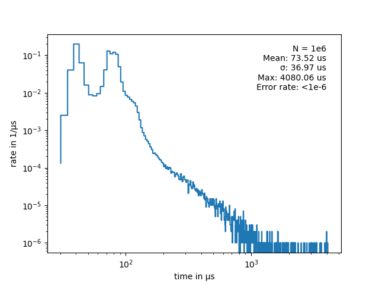
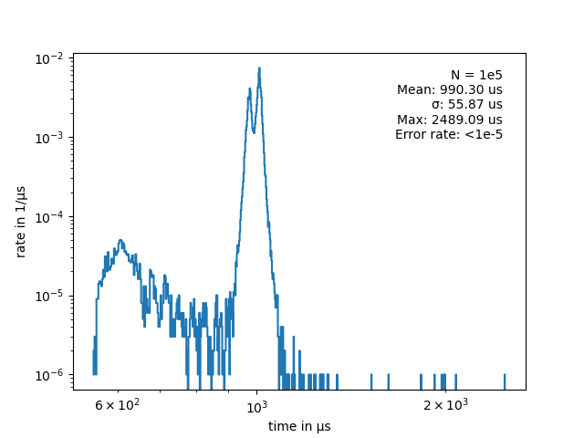

# Communication Latency
For many electronics project a architecture where a high level computer process talks with a low level microcontroller is useful.
Often it is expected to be happening in a certain time.

This repository is a collection of recorded times and tools.

For a ping using PySerial 3.5 and a RP2040 with the default usb-cdc implementation the measured distribution is:

On a esp32 with a hardware serial port (CP2102) the latency is considerably higher:
